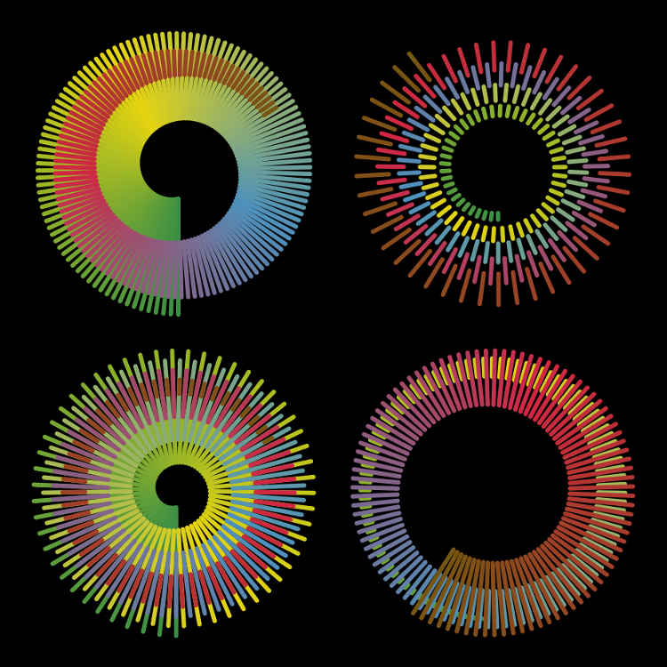

gradientfun.js
==============

### Fun with conical gradients in javascript ###

Actual purpose of this repository is to provide reusable classes for common tasks like for example throttling functions, draggable handles or color interpolation for gradients which occurred in other projects I have worked on.

There is a subproject with classes in vanilla JavaScript and one for usage with AngularJS.
Functionality in both (and their corresponding demos) is not necessarily equivalent since they were originally developed for other distinct projects and new functionality is only added on a per need basis.

[Vanilla JavaScript demo](http://daign.github.com/gradientfun.js/vanilla/) — [Demo with AngularJS](http://daign.github.com/gradientfun.js/angular/)

Licensed under [MIT License](https://github.com/daign/gradientfun.js/blob/master/LICENSE)

Dependencies:
* [tween.js](https://github.com/sole/tween.js)
* [angular.js](https://github.com/angular/angular.js)

